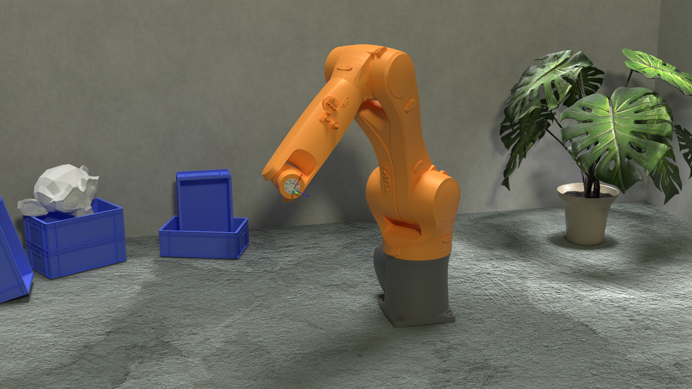

# KUKA Agilus in Blender

This is simple Blender scene containing the KUKA industrial robot model KR 6 R900 sixx. It is rigged and has inverse kinematics enabled.
This was inspired by [a post](https://machinekoder.com/animating-industrial-robots-with-blender/) made by Alex Rössler.

Here's a short clip of it in action: [youtube/ProD6t-96L4](https://www.youtube.com/watch?v=ProD6t-96L4)

## Other robots 
If you want to rig another robot, you can find meshes for various industrial robots over at the [ROS-Industrial](https://github.com/ros-industrial), that's where I got my meshes.
I then used the [specification sheet](https://www.kuka.com/-/media/kuka-downloads/imported/6b77eecacfe542d3b736af377562ecaa/0000205456_en.pdf) from KUKA to correctly position each mesh, and setting up the bones in Blender. 

There are tons of rigging tutorials out there, but non of them focuses on industrial robots like this.
[This one](https://www.youtube.com/watch?v=eF4CuIX40XE), as suggested by Alex, is a good starting point. I also found that [this](https://www.youtube.com/watch?v=1-5ZR45y9RM) and [this](https://www.youtube.com/watch?v=S-2v_CKmVE8) helped me a lot.

There are a ton of rigging tutorials out there, but none of them focuses on rigging of industrial robots. So I might write a blog post or make a video tutorial on it in the future.

